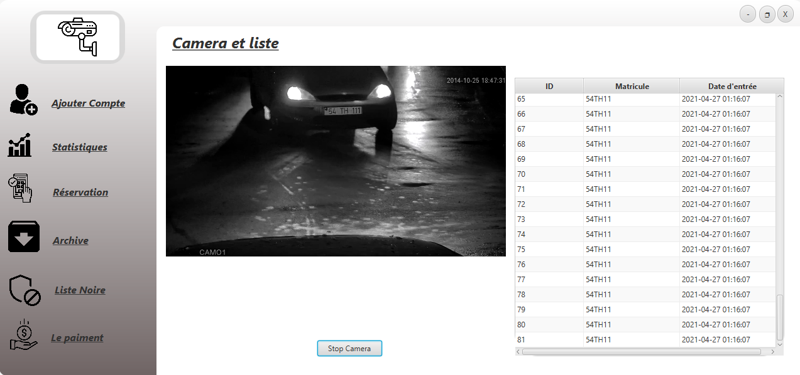

# Managment car park system

> Application GUI for managment car park system

---

### Table of Contents

- [Description](#description)
- [How To Use](#how-to-use)
- [License](#Screenshot)
- [Author Info](#Collaborator)
- [Screenshot](#Screenshot)
- [Collaborator](#Collaborator)

---

## Description

Creating Application GUI for managment car park ayatem with automatic license number plate recognition system using Java.

#### Technologies

- [Opencv](https://github.com/opencv/opencv.git)
- [OpenAlpr](https://github.com/openalpr/openalpr.git)
- [Javacpp](https://github.com/bytedeco/javacpp.git)
- [Javacv](https://github.com/bytedeco/javacpp-presets.git)

[Back To The Top](#Managment-car-park-system)

---

## How To Use

#### Installation

NB: before using the project you should install openALPR and opencv in your pc

- Clone the code
- Extract the zip file
- open the project with Maven project

[Back To The Top](#Managment-car-park-system)

---

## Screenshot

[Back To The Top](#Managment-car-park-system)

---

## Collaborator

- [Mohamed Oulma](https://github.com/oulma)
- [Atiqa Kacem](https://github.com/ATIQAkacem)
- [Mahdi el Atmani](https://github.com/mahdiatmani)
- [Oumaima Tijja](https://github.com/OmaimaTIJJA)
- [Chaimae Elannaoui](https://github.com/chaimae-elannaoui)

[Back To The Top](#Managment-car-park-system)
